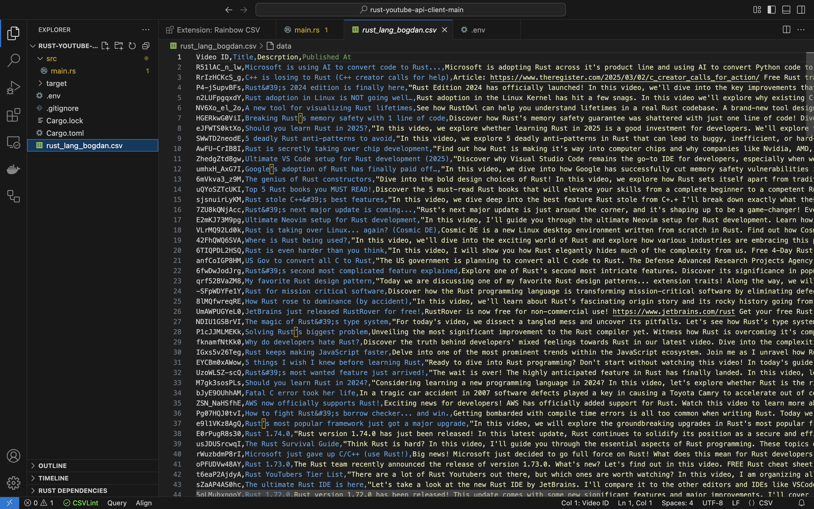

# You-got-tubed

This project fetches video data from YouTube and exports it as a CSV file using Rust.



## Features
- Fetches the latest videos from a YouTube channel. Sometimes, it can also be personal videos (__Use at your own discretion__)
- Saves video data (ID, title, description, published date) to a CSV file.
- Uses **async Rust** with `reqwest` for API requests.
- Secure API key handling with `.env`.

## Prerequisites
- Rust installed ([Get Rust](https://www.rust-lang.org/tools/install))
- Google Cloud account with YouTube Data API v3 enabled

## Setup

### Get YouTube API Key
- Go to [Google Cloud Console](https://console.cloud.google.com/).
- Create a new project, enable **YouTube Data API v3** and Generate an API key

### Clone This Repository
```sh
git clone https://github.com/vats004/you-got-tubed.git
cd youtube_video_fetcher
```

### Add API Key to `.env`
Create a `.env` file in the project root:
```env
YOUTUBE_API_KEY=YOUR_API_KEY
```

### Customization
Modify `channel_id` in `main.rs` to fetch videos from a different channel.

## Usage
Run the program to fetch videos and save them to a CSV file:
```sh
cargo build
cargo run
```

### Output
A CSV file (`channel_data.csv`) will be generated in the project directory containing:
- Video ID
- Title
- Description
- Published Date
